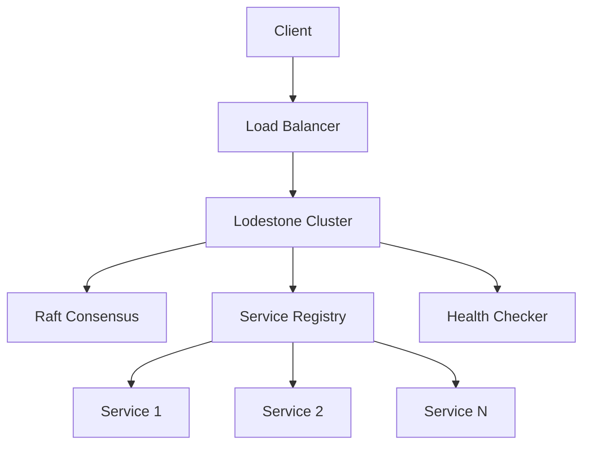

<div align="right">

</div>

# Lodestone

[](https://github.com/yourusername/lodestone/actions/workflows/rust.yml)
[](https://opensource.org/licenses/MIT)
[](https://crates.io/crates/lodestone)
[](https://docs.rs/lodestone)

A high-performance, distributed service discovery and routing system written in Rust.

## Features

### Core Functionality
- 🔍 **Service Discovery**: Dynamic registration and discovery of services
- 🌐 **Load Balancing**: Intelligent request distribution
- 🔒 **Security**: Built-in TLS, authentication, and authorization
- 🔄 **High Availability**: Raft consensus for reliable operation

### Technical Features
- **Consensus**
  - Raft-based leader election
  - State replication
  - Consistent service registry

- **Enhanced Routing**
  - Round-robin load balancing
  - Circuit breaker pattern
  - Route caching with TTL
  - WebSocket support

- **Security**
  - TLS/SSL support
  - JWT-based authentication
  - Role-based authorization
  - Rate limiting

## Architecture



## Quick Start

### Prerequisites
- Rust 1.75 or higher
- Cargo
- OpenSSL development packages

### Installation

```bash
# Clone the repository
git clone https://github.com/yourusername/lodestone.git
cd lodestone

# Build the project
cargo build --release
```

### WARNING

In production usage replace all keys and certs with your own these are in the repo for convenience purposes and should not be used on public instances or for any serious deployment

### Basic Usage

1. **Start the server**:
```bash
cargo run --release
```

2. **Register a service**:
```bash
curl -X POST http://localhost:8080/services \
  -H "Content-Type: application/json" \
  -d '{
    "name": "my-service",
    "address": "localhost",
    "port": 8000
  }'
```

3. **Query services**:
```bash
curl http://localhost:8080/services
```

## Configuration

Lodestone uses TOML for configuration. Create a `config/default.toml` file:

```toml
[server]
host = "127.0.0.1"
port = 8080

[security]
jwt_secret = "your-secret-key"
cert_path = "certs/server.crt"
key_path = "certs/server.key"

[raft]
node_id = 1
peers = [2, 3]
election_timeout = 1000
heartbeat_interval = 100
```

## API Reference

### Service Management
- `POST /services` - Register a new service
- `GET /services` - List all services
- `GET /services/{id}` - Get service details
- `DELETE /services/{id}` - Deregister a service

### Health Checking
- `GET /health` - System health check
- `GET /services/{id}/health` - Service health check

### Cluster Management
- `GET /cluster/status` - Get cluster status
- `GET /cluster/members` - List cluster members

## Development

### Project Structure
```
lodestone/
├── src/
│   ├── consensus/     # Raft consensus implementation
│   ├── discovery/     # Service discovery logic
│   ├── router/        # Request routing and load balancing
│   ├── security/      # Authentication and authorization
│   ├── store/         # Persistent storage
│   └── types.rs       # Common types and errors
├── config/
│   └── default.toml   # Default configuration
└── tests/             # Integration tests
```

### Running Tests
```bash
# Run all tests
cargo test

# Run specific test suite
cargo test --test integration_tests
```

## Performance

Performance benchmarks on a standard machine (8 CPU, 16GB RAM):

- Service Registration: < 5ms
- Service Discovery: < 2ms
- Route Resolution: < 1ms
- Concurrent Connections: 10,000+

## Contributing

We welcome contributions! Please see our [Contributing Guide](CONTRIBUTING.md) for details.

1. Fork the repository
2. Create your feature branch
3. Commit your changes
4. Push to the branch
5. Create a Pull Request

## License

This project is licensed under the MIT License - see the [LICENSE](LICENSE) file for details.

## Acknowledgments

- Built with [Rust](https://www.rust-lang.org/)
- Uses [Raft](https://raft.github.io/) consensus algorithm
- Inspired by Consul and Cloud Foundry's Go Router

---

<div align="center">
Made with ❤️ by the Lodestone team
</div>
